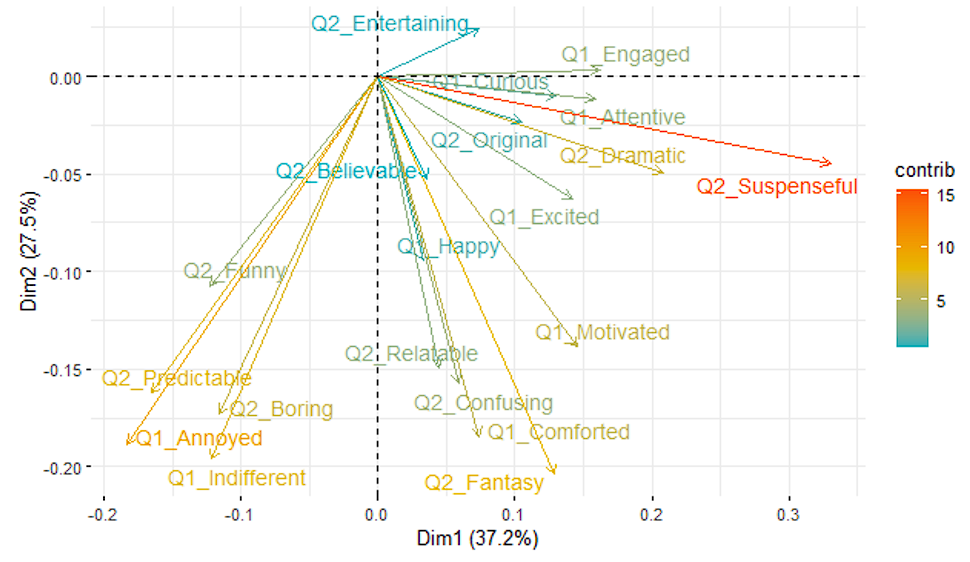
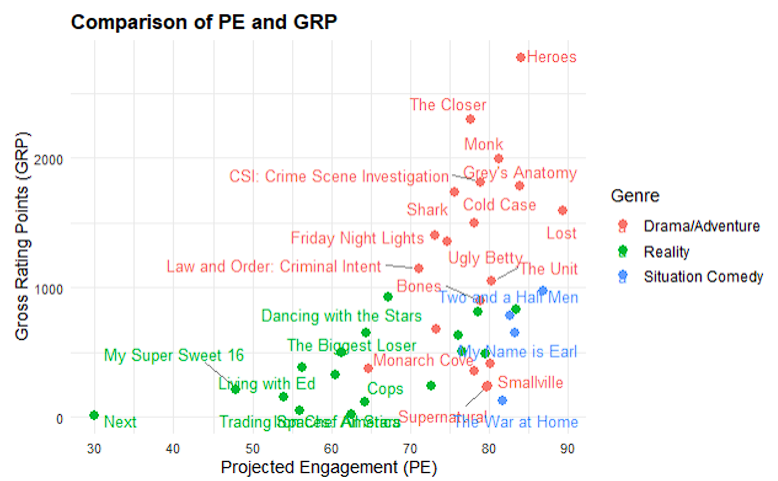

# Predicting TV Show Popularity

## Overview
This project, part of ECON-M518 at Indiana University Bloomington, led by Shiva Kumar Pendem, focuses on predicting the popularity of TV shows using Principal Component Regression (PCR). It addresses the challenges posed by multicollinearity in traditional regression methods.

## Data
The analysis is based on NBC show details, encompassing Gross Ratings Points (GRP) and Projected Engagement (PE) alongside audience survey responses.

## Methodology
- **Principal Component Regression (PCR)**: A technique combining Principal Component Analysis (PCA) and multiple linear regression to handle multicollinearity.
- **Data Standardization**: Ensuring equal weight for all variables in the analysis.
- **Model Interpretation**: Utilized various plots (Residuals vs Fitted, Normal Q-Q, etc.) for model validation.

## Key Findings
- PCR's effectiveness in dealing with multicollinearity and high-dimensional data.
  
- The significance of audience engagement factors like humor and predictability.
- Comparative analysis with LASSO regression highlighted PCR's robustness in handling multicollinearity.
  

## Conclusion
The project demonstrates PCR's utility in predictive modeling, offering valuable insights into TV show popularity based on audience engagement metrics.

